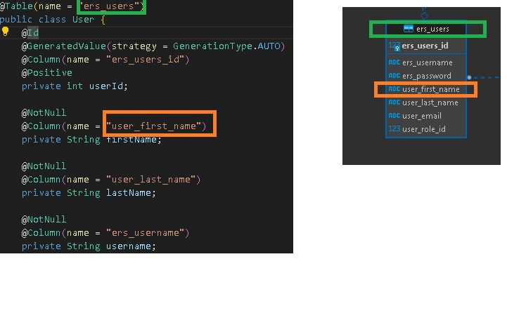

# P1 Spring Partial
> Implements getUserById and registerUser using Database from P1 

## Model
**Ensure Table and User Model attributes match that of ers_users** 
 

 

## Repo Instructions
- Go into src > main > resources > application.properties 
- Change datasource url, username, and password to match your P1  database details
- Run app, it loads at http://localhost:8080
- GET http://localhost:8080/api/users/{id} to retrive user by id ex:  http://localhost:8080/api/users/2
- POST http://localhost:8080/api/users/  and place user contents in body
- BODY: 
{
	"username":"abe",
	"firstName":"abraham",
	"lastName":"smith",
	"email":"abe@gmail.com",
	"password":"secret"}

## UserDao
- If you're wondering where the Sql, there is none. Spring generates it
